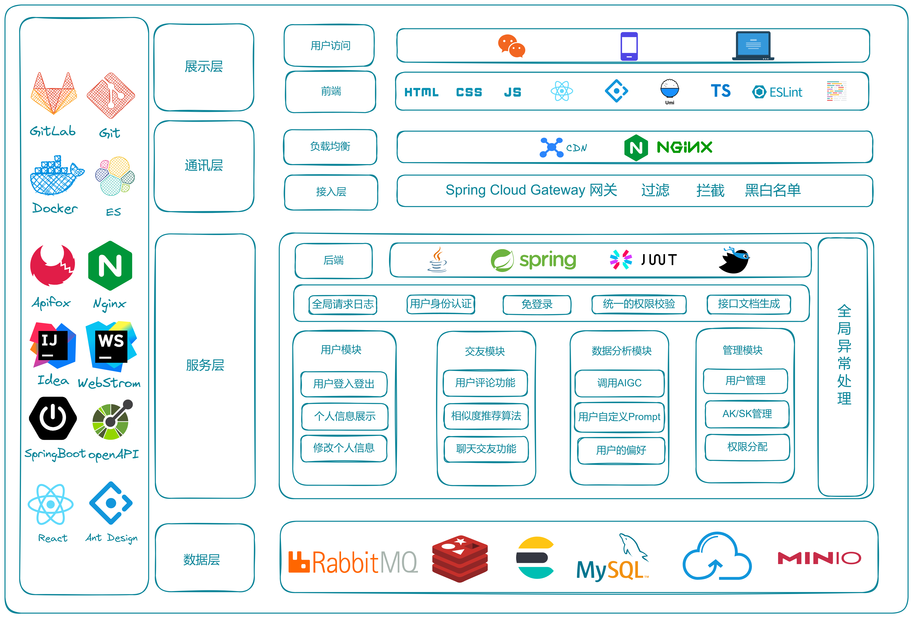
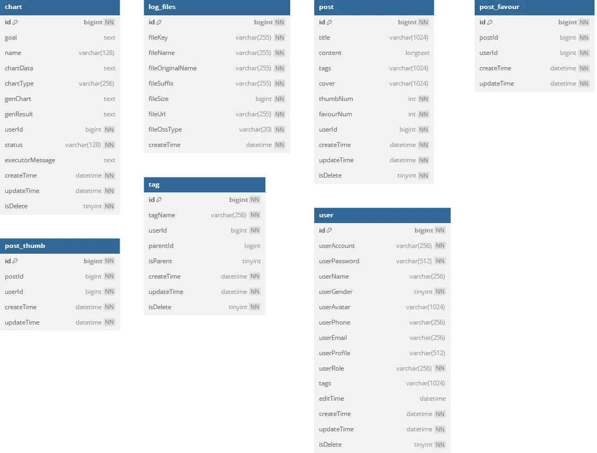

# 轨迹 Cloud (Trajectory Cloud)

<div align="center">


**基于 AIGC 的行业领先智能 BI 报表分析平台**

🚀 零门槛的数据洞察，工业级的云原生架构

[项目主页](https://stephenqhd30.github.io/) | [演示文档](./docs/) | [反馈问题](https://github.com/StephenQiu30/trajectory-cloud/issues) | [参与贡献](#-参与贡献)

</div>

---

## 🌟 核心价值

在数据爆炸时代，**轨迹 Cloud** 为开发者和企业提供了一套可直接落地的 AI + BI 解决方案：

*   **🤖 极简分析流程**：上传文件 -> 输入目标 -> AI 自动生成图表与专业报告。
*   **🏗️ 生产级微服务**：集成网关限流、分库分表、分布式鉴权等硬核架构。
*   **⚡ 高度工程化**：全链路采用设计模式优化，代码结构规范直观。
*   **📱 跨端一致体验**：基于响应式设计，完美适配 PC、平板与手机端。

---

## 🏗️ 系统架构 (Architecture)

### 1. 总体架构图
项目基于 Spring Cloud Alibaba 构建，采用微服务架构实现高可用与水平扩展。


### 2. 核心业务流程
AI 赋能的端到端数据分析闭环流程。


### 3. 数据表建模
基于业务逻辑的高性能数据库建模设计。


---

## 🚀 功能特性

-   **🤖 AIGC 智能助手**：深度接入 **LangChain4j**，实现对话式数据探查。
-   **📊 动态图表实验室**：支持柱状图、折线图、饼图等十余种动态交互图表。
-   **⚡ 高性能异步流**：RabbitMQ 驱动的异步分析管线，处理大文件不“卡顿”。
-   **🔍 聚合搜索矩阵**：集成 Elasticsearch，通过多种设计模式优化的复杂搜索。
-   **🤝 即时反馈中心**：WebSocket 全双工通信，任务进度秒级推送到端。
-   **🛡️ 分布式安全鉴权**：Sa-Token 护航，支持多端登录同步与权限精细隔离。

---

## 📸 界面视窗 (Gallery)

<div align="center">
  
  <p><i>🎨 仪表盘主控台视角 - 简洁、高效、现代</i></p>
</div>

<div align="center">
  <table border="0">
    <tr>
      <td></td>
      <td></td>
    </tr>
    <tr>
      <td align="center">智能分析与数据管理</td>
      <td align="center">多维可视化成果展示</td>
    </tr>
    <tr>
      <td colspan="2" align="center">
        
        <br/>
        <i>📱 移动端、平板端全场景响应式适配效果</i>
      </td>
    </tr>
  </table>
</div>

---

## 🛠️ 技术底座

| 维度 | 技术选型 |
| :--- | :--- |
| **微服务** | Spring Boot 3 + Spring Cloud Alibaba (Nacos, Sentinel, Gateway) |
| **鉴权** | Sa-Token (分布式登录、鉴权、单点登录、多端同步) |
| **存储** | MySQL 8 + ShardingSphere (分库分表) + Redis (缓存/会话) |
| **中间件** | Elasticsearch 7 + RabbitMQ + Hutool/EasyExcel |
| **AI/可视化** | LangChain4j + AntV G2/F2 + ECharts |

---

## 📂 模块导引

```text
trajectory-cloud
├── trajectory-gateway      # 统一 API 网关 (限流、鉴权、路由)
├── trajectory-api          # RPC 契约定义与共享 DTO
├── trajectory-common       # 核心基座封装 (Cache, MQ, MySQL, Web)
├── trajectory-service      # 业务逻辑微服务
│   ├── trajectory-user-service         # 鉴权中心、账户体系
│   ├── trajectory-ai-service           # AI 生成核心、任务调度
│   └── trajectory-notification-service # 消息枢纽、WebSocket 实现
```

---

## 🏃 快速启动

1.  **基础设施**：`docker-compose -f docker-compose-env.yml up -d`
2.  **配置注册**：配置导入 Nacos 控制台。
3.  **启动后端**：依次运行 `Gateway` 与各 `Service` 模块。
4.  **运行前端**：`cd ../trajectory-frontend && npm i && npm run dev`

---

## 🛣️ 发展路线 (Roadmap)

- [x] 基于 LangChain4j 的基础 BI 生产管线
- [ ] 持续集成：GitHub Actions 自动构建与镜像推送
- [ ] 多模态分析：支持图片的智能解析与图表转换
- [ ] 移动原生化：基于 React Native 的预览小程序

---

## 🤝 参与贡献

欢迎任何形式的贡献！请阅读 [贡献说明](#-参与贡献) 或直接提交 PR。

---

**维护者**: [StephenQiu30](https://github.com/StephenQiu30)  
**开源许可**: [MIT License](./LICENSE)
