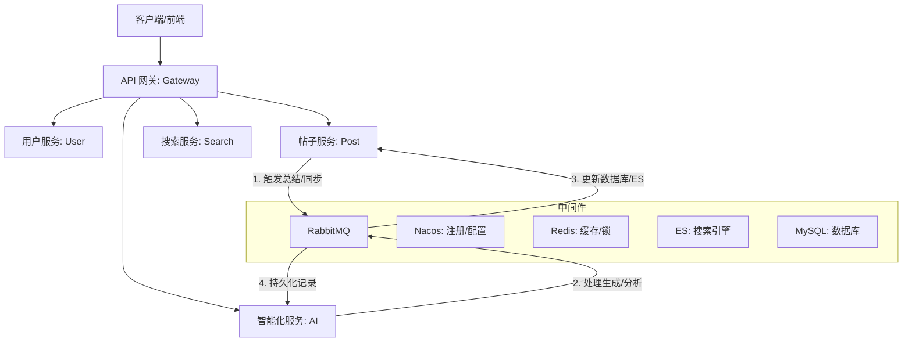

# 轨迹 - 基于 AIGC 的数据可视化平台

基于 **Spring Cloud Alibaba** 深度构建的分布式微服务解决方案，旨在打造一款智能、高效的数据可视化平台，采用最新的 **Java 21
** 和 **Spring Boot 3.5.9** 技术栈。

## 🌟 项目亮点

- **前沿技术栈**：全面拥抱 Java 21 特性，集成 Spring Boot 3.5.x 与 Spring Cloud 2025。
- **完善的微服务生态**：全方位的服务矩阵，包括 AI 服务、全文检索、实时通信等。
- **智能化增强**：集成 **LangChain4j** 大模型能力，支持阿里云通义千问 (DashScope) 深度适配。
- **AI 赋能业务**：支持**智能数据分析**与**可视化图表生成**，通过 RabbitMQ 实现异步生成任务的稳健处理。
- **高性能异步架构**：基于 RabbitMQ 实现智能分析任务的异步分发与处理。
- **全链路日志采集**：集成了详尽的操作日志以及 AI Token 使用追踪体系，支持 ELK 日志收集。

## 🏗️ 架构概览



### 服务模块说明

| 模块名称 | 功能描述 | 端口 | 状态 |
| :--- | :--- | :--- | :--- |
| `trajectory-gateway` | **统一网关**：负责路由转发、鉴权、限流与全链路日志采样 | 8080 | ✅ |
| `trajectory-user-service` | **用户中心**：支持 GitHub、邮箱验证码登录及 RBAC 权限管理 | 8081 | ✅ |
| `trajectory-notification-service` | **通知中心**：系统通知分发、基于 MQ/WebSocket 的实时消息推送 | 8082 | ✅ |
| `trajectory-ai-service` | **智能分析**：集成 LangChain4j，提供 Excel/数据智能分析与图表生成 | 8083 | ✅ |

---

## 🚀 核心特性

- 🛠 **工程底座**：基于 Java 21 虚拟线程 (探索中) 与 Spring Boot 3.5.x，享受最新 JVM 性能红利。
- 🤖 **AIGC 深度集成**：内置大模型调用封装，支持对话分析、数据提取与 Echarts 图表配置自动生成。
- 🔑 **安全认证**：集成 Sa-Token 框架，实现微服务下的分布式会话共享与跨服务鉴权。
- 📊 **数据驱动**：集成 EasyExcel 提供高性能表格解析，利用 RabbitMQ 完成耗时分析任务的异步削峰治理。
- 📜 **精益文档**：全量代码覆盖 JavaDoc 与 Swagger (Knife4j) 接口文档，所见即所得。

## 📖 接口指南 (API Documentation)

项目集成 **Knife4j**，启动后可通过以下地址访问各微服务文档：

- **网关聚合文档**: [http://localhost:8080/doc.html](http://localhost:8080/doc.html)
- **用户服务**: `http://localhost:8081/doc.html`
- **通知服务**: `http://localhost:8082/doc.html`
- **AI 服务**: `http://localhost:8083/doc.html`

> [!TIP]
> 推荐通过 **网关端口 (8080)** 统一查看聚合后的 Open API 文档。

## 🎯 技术栈详情

| 领域 | 核心技术 | 版本 |
| :--- | :--- | :--- |
| **Java 运行环境** | JDK | 21 |
| **AI 框架** | LangChain4j | 0.36.2 |
| **核心框架** | Spring Boot | 3.5.9 |
| **微服务治理** | Spring Cloud Alibaba | 2023.0.3.2 |
| **服务网关** | Spring Cloud Gateway | 5.0.1 |
| **数据库** | MySQL / MyBatis-Plus | 8.4 / 3.5.12 |
| **缓存/分布式锁** | Redis / Redisson | 7.4 / 3.48.0 |
| **消息队列** | RabbitMQ | 4.x |
| **搜索引擎** | Elasticsearch | 9.3.0 |
| **认证鉴权** | Sa-Token | 1.44.0 |
| **文档工具** | Knife4j | 4.5.0 |

## 📮 消息队列 use 指南

项目通过 `trajectory-common-rabbitmq` 模块对 RabbitMQ 进行了深度封装，实现了**生产端事务保障**与**消费端自动化分发**。

### 1. 生产者 (Producer)

注入 `MqSender` 即可发送消息。

- **普通发送**：`mqSender.send(bizType, data)`
- **事务发送**：`mqSender.sendTransactional(bizType, data)`，确保消息在本地数据库事务提交后才真正发出。

### 2. 消费者 (Consumer)

1. **定义 Handler**：实现 `MqHandler<T>` 接口并注入为 Bean，标记 `@MqIdempotent` 进行分布式去重。
2. **统一调度**：在具体的 `@RabbitListener` 中调用 `mqConsumerDispatcher.dispatch(rabbitMessage, channel, msg)`，系统将根据
   `bizType` 自动匹配 Handler 及其对应的 DTO 类型。

> 更多细节请参考 [RabbitMQ 模块文档](trajectory-common/trajectory-common-rabbitmq/README.md)。

## 🚀 快速启动

本项目采用**环境 (Middleware)** 与 **业务 (Application)** 分离的容器化部署方案。

### 0. 前置准备

- **Docker & Docker Compose**: 确保已安装最新版本。
- **Java 21**: 本地调试需要 JDK 21 环境。
- **Maven**: 用于项目打包。

### 1. 配置环境变量 (`.env`)

项目根目录下的 [.env](.env) 文件集中管理了所有服务的敏感信息和端口。
> [!IMPORTANT]
> 由于安全原因，`.env` 文件不会被提交到仓库。请先通过以下命令创建：
> `cp .env.example .env`
> 然后根据你的本地环境修改 `.env` 中的配置。

- `DEFAULT_PASSWORD`: 统一的默认密码。
- `MYSQL_PORT_EXTERNAL`: 宿主机访问 MySQL 的端口 (默认 `13306`)。
- `ES_VERSION`: Elasticsearch 版本 (需与本地环境匹配，当前为 `9.3.0-arm64`)。

### 2. 部署基础环境 (Infrastructure - 本地)

基础环境包含 MySQL, Redis, Nacos, RabbitMQ, ES 等中间件。

```bash
# 启动本地中间件环境
docker compose -f docker-compose-env.yml up -d
```

> [!TIP]
> **初始化工作**：
> - **数据库**：首次启动后，请根据 `sql/README.md` 执行初始化脚本。
> - **配置中心**：访问 Nacos (`http://localhost:8840/nacos`) 并导入 `nacos-config/` 下的配置文件。
    >
- *注：请参考示例文件自行创建生产环境配置。*

### 3. 部署业务项目 (Application - 本地)

在环境准备就绪后，使用本地 `.env` 启动网关及所有业务微服务。

```bash
# 使用本地环境变量启动业务微服务
docker compose --env-file .env -f docker-compose.yml up -d --build
```

### 4. 生产环境部署 (Production)

生产环境推荐使用 `.env.prod` 管理线上变量，并通过 `docker-compose-env.yml` 与 `docker-compose.yml` 分离环境与业务。

1. 准备 `.env.prod`：
   - `NACOS_HOST`: 生产环境 Nacos 服务器 IP。
   - `NACOS_PORT`: 默认 `8848`。
   - `NACOS_AUTH_TOKEN`: **长度 ≥ 32 字节且 Base64 编码** 的密钥，用于 Nacos 认证。
   - `NACOS_AUTH_IDENTITY_KEY` / `NACOS_AUTH_IDENTITY_VALUE`: 与 Nacos 配置中保持一致。
   - `GATEWAY_PORT_EXTERNAL` / `USER_SERVICE_PORT_EXTERNAL` / `NOTIFICATION_SERVICE_PORT_EXTERNAL` / `AI_SERVICE_PORT_EXTERNAL`:
     与实际暴露的宿主机端口保持一致（如均为 `8080`~`8083`）。

2. 启动生产环境中间件：

```bash
docker compose --env-file .env.prod -f docker-compose-env.yml up -d --build
```

3. 启动生产环境业务微服务：

```bash
docker compose --env-file .env.prod -f docker-compose.yml up -d --build
```

### 5. 服务访问入口

| 服务                | 宿主机地址                         | 默认账号            | 默认密码                  |
|:------------------|:------------------------------|:----------------|:----------------------|
| **API 网关/业务入口**   | `http://localhost:8080`       | -               | -                     |
| **Nacos 控制台**     | `http://localhost:8840/nacos` | `nacos`         | `nacos`               |
| **RabbitMQ 管理**   | `http://localhost:15672`      | `guest`         | `guest`               |
| **MinIO 控制台**     | `http://localhost:19001`      | `admin`         | `${DEFAULT_PASSWORD}` |
| **Elasticsearch** | `http://localhost:9200`       | `elastic`       | `${DEFAULT_PASSWORD}` |
| **Kibana 可视化**    | `http://localhost:5601`       | `kibana_system` | `${DEFAULT_PASSWORD}` |
| **Redis**         | `localhost:16379`             | -               | -                     |
| **MySQL**         | `localhost:13306`             | `root`          | `${DEFAULT_PASSWORD}` |

### 6. 常见问题排查（部署相关）

- **Nacos 客户端仍然连接 `localhost:8848`**
  - 确认启动业务微服务时使用了对应环境的 `--env-file` 参数（如 `.env` 或 `.env.prod`）。
  - 检查容器中的 `SPRING_CLOUD_NACOS_CONFIG_SERVER_ADDR` / `SPRING_CLOUD_NACOS_DISCOVERY_SERVER_ADDR` 是否为预期的 Nacos 地址。

- **Nacos 日志报错 `Server check fail, port 9848`**
  - 确认 `docker-compose-env.yml` 对应的 Nacos 环境栈已正常启动。
  - 在宿主机执行 `ss -tulnp | grep 9848`，确认 9848 端口已监听并开放。
  - 检查云服务器安全组 / 防火墙是否放行 9848/9849/9850 端口。

- **Nacos 启动报错 `the length of secret key must great than or equal 32 bytes`**
  - 确认 `.env.prod` 中的 `NACOS_AUTH_TOKEN` 为 **Base64 编码后的字符串**，且解码后长度 ≥ 32 字节。
  - 修改后重新通过 `docker compose --env-file .env.prod -f docker-compose-env.yml up -d --build` 重启 Nacos 容器。

---

**维护者**: StephenQiu30  
**许可证**: [MIT License](LICENSE)
