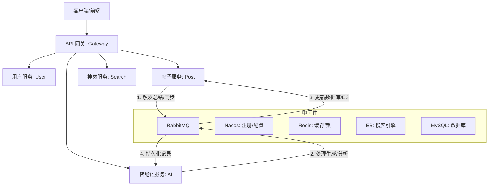

# 轨迹 - 基于 AIGC 的数据可视化平台

基于 **Spring Cloud Alibaba** 深度构建的分布式微服务解决方案，旨在打造一款智能、高效的数据可视化平台，采用最新的 **Java 21
** 和 **Spring Boot 3.5.9** 技术栈。

## 🌟 项目亮点

- **前沿技术栈**：全面拥抱 Java 21 特性，集成 Spring Boot 3.5.x 与 Spring Cloud 2025。
- **完善的微服务生态**：全方位的服务矩阵，包括 AI 服务、全文检索、实时通信等。
- **智能化增强**：集成 **LangChain4j** 大模型能力，支持阿里云通义千问 (DashScope) 深度适配。
- **AI 赋能业务**：支持**智能数据分析**与**可视化图表生成**，通过 RabbitMQ 实现异步生成任务的稳健处理。
- **高性能异步架构**：基于 RabbitMQ 实现智能分析任务的异步分发与处理。
- **全链路日志采集**：集成了详尽的操作日志以及 AI Token 使用追踪体系，支持 ELK 日志收集。

## 🏗️ 架构概览



### 服务模块说明

| 模块名称                              | 功能描述                  | 端口   |
|:----------------------------------|:----------------------|:-----|
| `trajectory-gateway`              | API 网关：路由转发、鉴权、限流     | 8080 |
| `trajectory-user-service`         | 用户服务：账号、权限、多端登录       | 8081 |
| ``                                | 帖子服务：内容、互动、数据统计       | 8082 |
| `trajectory-notification-service` | 通知服务：系统消息、实时推送        | 8083 |
| `trajectory-search-service`       | 搜索服务：基于 ES 的聚合检索      | 8084 |
| `trajectory-file-service`         | 文件服务：对象存储 (COS/MinIO) | 8085 |
| `trajectory-log-service`          | 日志服务：全链路日志采集与存储       | 8086 |
| `trajectory-mail-service`         | 邮件服务：验证码、告警发送         | 8087 |
| `trajectory-ai-service`           | AI 服务：智能数据分析与可视化处理    | 8089 |

## 🎯 技术栈

| 领域             | 核心技术                 | 版本           |
|:---------------|:---------------------|:-------------|
| Java 运行环境      | JDK                  | 21           |
| AI 框架          | LangChain4j          | 0.36.2       |
| 核心框架           | Spring Boot          | 3.5.9        |
| 微服务治理          | Spring Cloud Alibaba | 2023.0.3.2   |
| 服务网关           | Spring Cloud Gateway | 5.0.1        |
| 数据库            | MySQL                | 8.0          |
| 持久层框架          | MyBatis-Plus         | 3.5.12       |
| 缓存/分布式锁        | Redis & Redisson     | 7.4 / 3.48.0 |
| 消息队列           | RabbitMQ             | 4.2.3        |
| 搜索引擎           | Elasticsearch        | 9.3.0        |
| 通讯框架           | Netty                | 4.2.5.Final  |
| 认证鉴权           | Sa-Token             | 1.44.0       |
| 监控配置: Actuator | Spring Boot Actuator | 3.5.9        |

## 📮 消息队列 use 指南

项目通过 `trajectory-common-rabbitmq` 模块对 RabbitMQ 进行了深度封装，实现了**生产端事务保障**与**消费端自动化分发**。

### 1. 生产者 (Producer)

注入 `MqSender` 即可发送消息。

- **普通发送**：`mqSender.send(bizType, data)`
- **事务发送**：`mqSender.sendTransactional(bizType, data)`，确保消息在本地数据库事务提交后才真正发出。

### 2. 消费者 (Consumer)

1. **定义 Handler**：实现 `MqHandler<T>` 接口并注入为 Bean，标记 `@MqIdempotent` 进行分布式去重。
2. **统一调度**：在具体的 `@RabbitListener` 中调用 `mqConsumerDispatcher.dispatch(rabbitMessage, channel, msg)`，系统将根据
   `bizType` 自动匹配 Handler 及其对应的 DTO 类型。

> 更多细节请参考 [RabbitMQ 模块文档](trajectory-common/trajectory-common-rabbitmq/README.md)。

## 🚀 快速启动

本项目采用**环境 (Middleware)** 与 **业务 (Application)** 分离的容器化部署方案。

### 0. 前置准备
- **Docker & Docker Compose**: 确保已安装最新版本。
- **Java 21**: 本地调试需要 JDK 21 环境。
- **Maven**: 用于项目打包。

### 1. 配置环境变量 (`.env`)
项目根目录下的 [.env](.env) 文件集中管理了所有服务的敏感信息和端口。
> [!IMPORTANT]
> 由于安全原因，`.env` 文件不会被提交到仓库。请先通过以下命令创建：
> `cp .env.example .env`
> 然后根据你的本地环境修改 `.env` 中的配置。

- `DEFAULT_PASSWORD`: 统一的默认密码。
- `MYSQL_PORT_EXTERNAL`: 宿主机访问 MySQL 的端口 (默认 `13306`)。
- `ES_VERSION`: Elasticsearch 版本 (需与本地环境匹配，当前为 `9.3.0-arm64`)。

### 2. 部署基础环境 (Infrastructure)
基础环境包含 MySQL, Redis, Nacos, RabbitMQ, ES 等中间件。

```bash
# 启动中间件环境
docker-compose -f docker-compose-env.yml up -d
```

> [!TIP]
> **初始化工作**：
> - **数据库**：首次启动后，请根据 `sql/README.md` 执行初始化脚本。
> - **配置中心**：访问 Nacos (`http://localhost:8840/nacos`) 并导入 `nacos-config/` 下的配置文件。
>   - *注：出于安全考虑，`*-prod.*` (生产配置) 和 `common-secret.*` (敏感密钥) 已被 `.gitignore` 忽略，请参考示例文件自行创建。*

### 3. 部署业务项目 (Application)
在环境准备就绪后，启动网关及所有业务微服务。

```bash
# 1.项目打包 (跳过测试)
mvn clean package -DskipTests

# 2. 启动业务容器
docker-compose up -d --build
```

### 4. 服务访问入口
| 服务 | 宿主机地址 | 默认账号 | 默认密码 |
|:---|:---|:---|:---|
| **API 网关/业务入口** | `http://localhost:8080` | - | - |
| **Nacos 控制台** | `http://localhost:8840/nacos` | `nacos` | `nacos` |
| **RabbitMQ 管理** | `http://localhost:15672` | `guest` | `guest` |
| **MinIO 控制台** | `http://localhost:19001` | `admin` | `stephenqhd30.` |
| **Elasticsearch** | `http://localhost:9200` | `elastic` | `YbG5Wvvm` |
| **Kibana 可视化** | `http://localhost:5601` | `kibana_system` | `Eg1lqM4C` |
| **Redis** | `localhost:16379` | - | - |
| **MySQL** | `localhost:13306` | `root` | `stephenqhd30.` |

---

**维护者**: StephenQiu30  
**许可证**: [MIT License](LICENSE)
