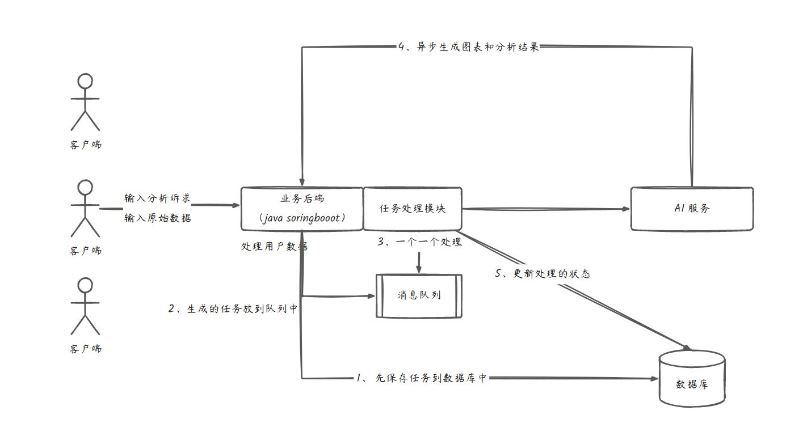

# trajectory-ai-service (智能分析服务)

  

> **轨迹 Cloud 的智慧大脑：基于 AIGC 技术的数据解析与图表自动生成中心**

## 🧩 处理流程图

---

## 🚀 核心特性

-   **🤖 智能图表生成**：对接 **阿里云 DashScope (通义千问)**，根据用户上传的原始数据（CSV/Excel）自动推理最适合的图表类型。
-   **📊 深度数据分析**：自动生成多维度的结论性文字描述，提炼核心指标，辅助商业决策。
-   **⚡ 异步任务流水线**：集成 **RabbitMQ** 实现重型 AI 任务的异步排队处理。
-   **📂 百万级数据解析**：利用 **EasyExcel** 高效解析海量数据，大幅降低 JVM 内存消耗。
-   **🏗️ 设计模式实践**：采用 **注册器模式 (Registry)** 动态调度 AI 策略，**适配器模式 (Adapter)** 屏蔽不同大模型的接口差异。

---

## 📸 界面视窗

  
  
<i>智能分析主控台视角</i>

---

## 🏃 启动与运行

-   **服务端口**: `8083`
-   **前置要求**:
    -   配置 Nacos 环境。
    -   注入 `dashscope.api-key`。
-   **启动引导**: 运行 `AiServiceApplication.java`。

---

**维护者**: [StephenQiu30](https://github.com/StephenQiu30)  
**版本**: 1.0.0
