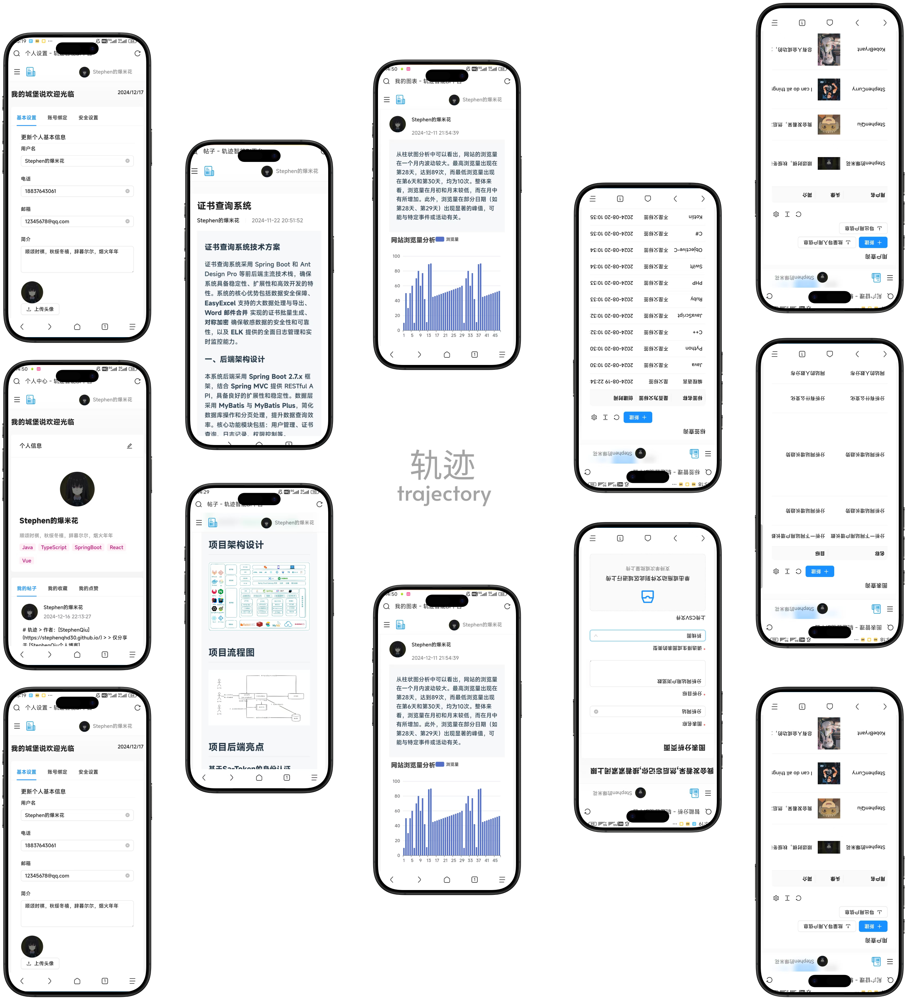

# trajectory-notification-service (消息与实时通知服务)

  

> **轨迹 Cloud 的交互枢纽：负责系统全局消息分发与基于 WebSocket 的低延迟实时通知推送**

## 📱 移动端适配展示

  

---

## 🚀 核心能力

-   **🔔 即时通知推送**：当 AI 分析完成、任务失败或系统公告下发时，秒级推送到用户浏览器或移动端。
-   **💬 实时连接管理**：基于 **WebSocket** 的全双工长链接维护，支持大规模并发连接的集群化管理。
-   **📬 消息可靠性保障**：利用 **RabbitMQ** 进行消息中转，确保网络波动时消息不丢失（通过回执重发）。
-   **📅 历史消息中心**：提供用户个人通知的历史记录检索、未读数统计及一键已读功能。

---

## 🚀 启动与运行

-   **服务端口**: `8082`
-   **WebSocket 端口**: `9090`
-   **启动引导**: 运行 `NotificationServiceApplication.java`。

---

**维护者**: [StephenQiu30](https://github.com/StephenQiu30)  
**版本**: 1.0.0
