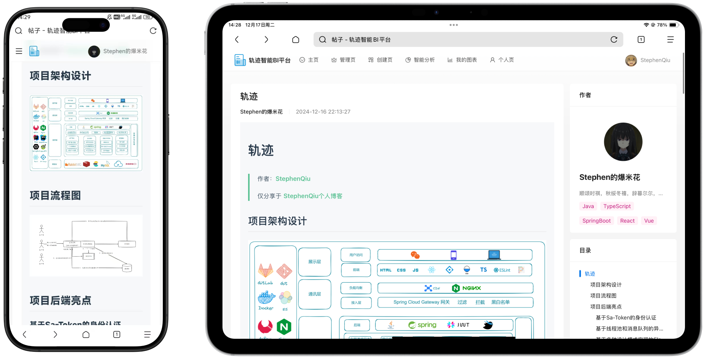
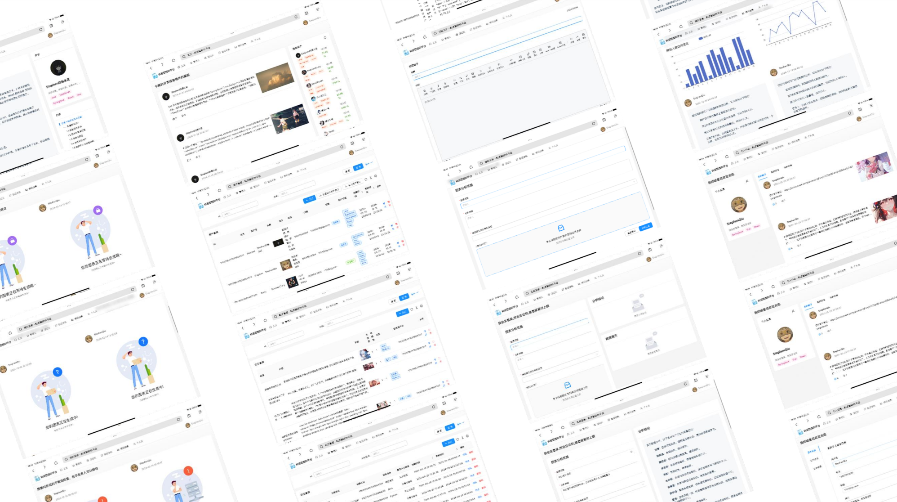

# trajectory-user-service (用户与鉴权服务)

  

> **轨迹 Cloud 的安全基石：负责全系统的账号管理、统一身份认证与高颗粒度鉴权**

## 📸 界面展示

---

## 🚀 核心功能

-   **🔐 统一鉴权中心**：基于 **Sa-Token** 实现分布式登录、踢人下线、单点登录 (SSO) 及 Token 有效期自动续期。
-   **👤 用户体系管理**：支持邮箱注册、第三方社交登录 (预留) 及完整的基础信息维护。
-   **🛡️ 角色权限管控 (RBAC)**：实现细粒度的接口权限控制，支持动态角色分配。
-   **📁 个人资产管理**：管理用户上传的原始数据集、生成的分析报告及其生命周期。

---

## 🏃 快速启动

-   **服务端口**: `8081`
-   **数据库初始化**: 执行 `sql/user.sql`。
-   **启动模块**: 启动 `UserServiceApplication.java`。

---

**维护者**: [StephenQiu30](https://github.com/StephenQiu30)  
**版本**: 1.0.0
